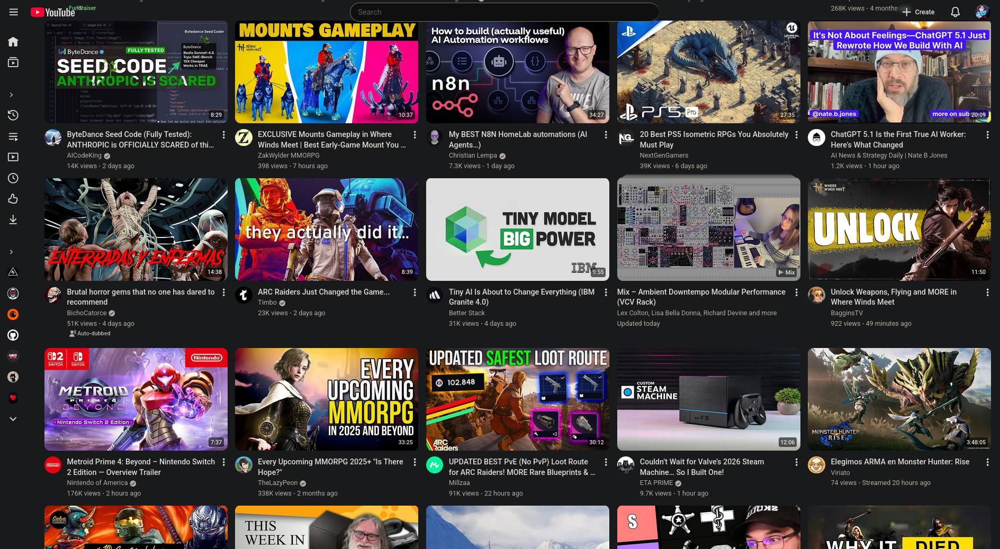
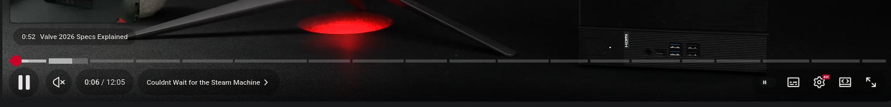
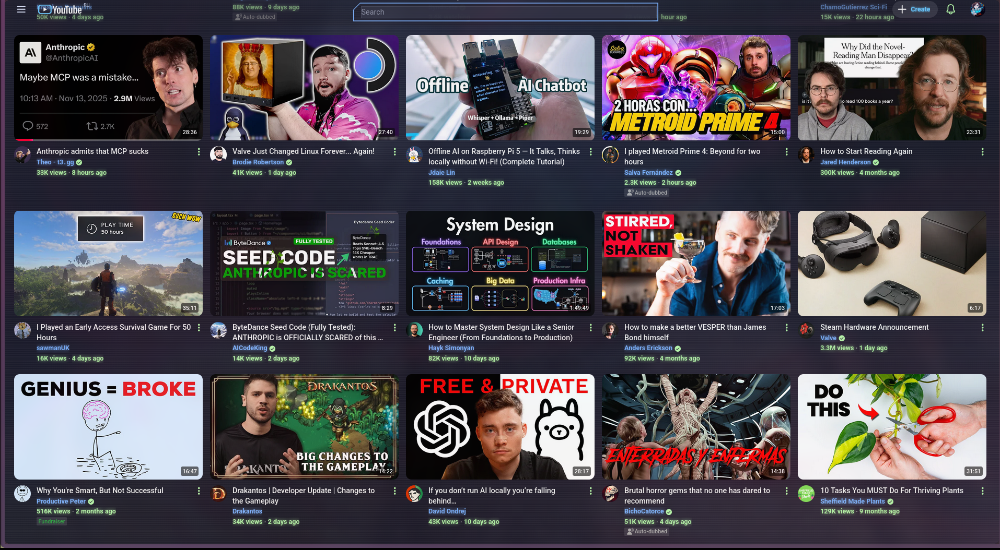
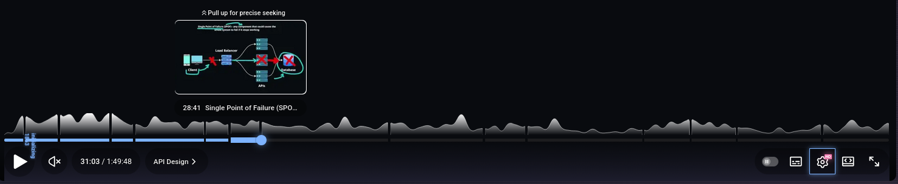

# Catpcypher – Neon Sanctuary for YouTube

<div align="center">


**"Pour neon over the algorithm and let it breathe."**

⚠️ Prolonged exposure may cause neon addiction, vanilla UI rejection, and compulsive gradient hacking. Side effects include: seeing YouTube as a cyberpunk console, believing default UI is an aesthetic crime, and shouting "I NEED MORE BLOOM" in public. Not responsible if your browser gains sentience.

[Install Now](#-install) · [Features](#-features) · [Screenshots](#-screenshots) · [Customize](#-customization) · [FAQ](#-faq)

</div>

---

## What Is This?

Catpcypher is a **neon manifesto** against sterile UI. It hijacks YouTube's vanilla skin and injects vapor gradients, aurora pulses, and synth-noise overlays so the entire platform feels like a **cyberpunk HUD** — especially on ZEN or any Stylus-ready browser.

Built on the Catppuccin Mocha palette with custom neon accents, clip-path cybernetic borders, and context-aware button glows. Every surface, every scrollbar, every menu has been weaponized.

---

## Screenshots

<table>
<tr>
<td width="50%">

### Vanilla YouTube


*Default UI. Aesthetic crime in progress.*



*Grey scrollbar energy: dangerously high.*

</td>
<td width="50%">

### Catpcypher


*Chromatic countermeasure deployed.*



*Scrollbars upgraded to vapor-grade cyber rails.*

</td>
</tr>
</table>

---

## Features

| Component | Status | Details |
|-----------|--------|---------|
| Aurora Veil Gradients | ✅ | Multi-layer radial + linear gradients with `aestheticPulse` animation |
| Glass Panel Overlays | ✅ | Translucent cards with `clip-path` cybernetic borders |
| Cyber Scrollbars | ✅ | Full `::-webkit-scrollbar` + `scrollbar-color` styling |
| Neon Color Palette | ✅ | 40+ custom CSS variables based on Catppuccin Mocha |
| Custom Wallpaper System | ✅ | `--wallpa1` radial gradient overlay + `--wallpas` positioning hooks |
| Shorts Elimination | ✅ | Hides Shorts from feed, sidebar, and navigation |
| Ad Overlay Suppression | ✅ | Removes ad overlays and promotional banners |
| Animated Logo Effects | ✅ | `rubberBand` hover + `yadlogo2` load animation |
| Context-Aware Button Glows | ✅ | Like = pink, Subscribe = blue, all hover = cyan |
| Cybernetic Menu Animations | ✅ | `galaw1`/`galaw2`/`galaw3` clip-path reveal animations |
| Custom Font Loading | ✅ | 13 @font-face declarations (Orbitron, Oxanium, Rye, etc.) |
| Multi-Domain Coverage | ✅ | `@-moz-document` covers youtube.com + regional TLDs |
| Responsive Grid | ✅ | 5/4/3/2 column breakpoints via `@media` queries |
| Accessibility | ✅ | `:focus-visible` outlines, keyboard nav, contrast ratios |
| Dark Mode Enforcement | ✅ | `color-scheme: dark` + `prefers-color-scheme` fallback |

### Highlights

- **Aurora Veil** — Multi-layer gradients breathe slowly via `aestheticPulse` to keep the backdrop alive without drowning content
- **Glass Panels** — Menus, search dropdowns, and chips use `clip-path` polygon borders with `::before`/`::after` layering for a cybernetic frame effect
- **Cyber Scrollbars** — Tracks and thumbs use palette-matched accents with neon glow on hover
- **Context-Aware Glows** — Like buttons glow pink, subscribe buttons glow blue, all interactive elements glow cyan on hover
- **Shorts Elimination** — Hides Shorts from feed, sidebar, and navigation completely
- **Ad Overlay Suppression** — Removes ad overlay buttons and promotional banners
- **7 Keyframe Animations** — `yadlogo2`, `aestheticPulse`, `rubberBand`, `galaw1`, `galaw2`, `galaw3`, `pulse`
- **13 Custom Fonts** — Orbitron, Oxanium, Rye, Carter One, Lacquer, Poiret One, Indie Flower, Shadows Into Light, Righteous, Pixelify, Jersey, DS-Digital, and a custom font slot
- **Global Coverage** — `@-moz-document` patterns cover youtube.com plus regional TLD variants

---

## Install

### Method 1: One-Click (Recommended)

1. **Install Stylus** — [Firefox](https://addons.mozilla.org/en-US/firefox/addon/styl-us/) · [Chrome](https://chrome.google.com/webstore/detail/stylus/clngdbkpkpeebahjckkjfobafhncgmne)
2. **Click to install** — [Install Catpcypher](https://raw.githubusercontent.com/ind4skylivey/catpcypher_youtube/main/catpcypher-youtube.user.css)
3. **Refresh YouTube**

### Method 2: userstyle.world

[Install on userstyle.world](https://userstyles.world/style/27946) — auto-updates included.

### Method 3: Manual

```bash
git clone https://github.com/ind4skylivey/catpcypher_youtube.git
cd catpcypher_youtube
# Open Stylus → Manage → Write New Style → Paste catpcypher-youtube.user.css
```

### Method 4: Auto-Update

1. Open the raw view of `catpcypher-youtube.user.css`
2. Stylus displays an **Install style** banner — click it
3. Toggle **Auto-update** in Stylus settings

---

## Compatibility

| Browser | Status | Notes |
|---------|--------|-------|
| Firefox | ✅ | Native habitat |
| Zen Browser | ✅ | Built for this |
| Chrome / Brave | ✅ | Even Google can't stop it |
| Vivaldi | ✅ | Already aesthetic, now MORE |
| Arc | ✅ | Matches the vibe |
| Safari | ⚠️ | Untested |

**Requirement:** [Stylus extension](https://github.com/openstyles/stylus)

---

## Customization

All colors and dimensions are controlled by CSS custom properties. Edit the variables block near the top of the file (inside `*, html, [dark], [light], html[dark], html[light]`) to remix the entire theme without touching selectors.

### Core Colors

| Variable | Default | Purpose |
|----------|---------|---------|
| `--acc` | `#7db3ff` | Primary accent (blue) |
| `--acc2` | `#ff7eb6` | Secondary accent (pink) |
| `--acc3` | `rgba(125, 179, 255, 0.3)` | Blue glow (borders, shadows) |
| `--acc4` | `rgba(255, 126, 182, 0.25)` | Pink glow (borders, shadows) |
| `--bg0` | `rgba(49, 50, 68, 0.5)` | Surface 0 (translucent) |
| `--bg1` | `#313244` | Surface 1 |
| `--bg2` | `#1e1e2e` | Base (darkest background) |
| `--bg3` | `#45475a` | Surface 2 (hover states) |
| `--bg4` | `#7db3ff` | Blue accent (elevated) |

### Text Colors

| Variable | Default | Purpose |
|----------|---------|---------|
| `--tx1` | `#e0e7ff` | Primary text |
| `--tx2` | `#c9d1e8` | Secondary text |
| `--tx3` | `#7db3ff` | Blue text accent |
| `--tx4` | `#ff7eb6` | Pink text accent |
| `--tx5` | `#b4f5a8` | Green text accent |

### Glow & Neon

| Variable | Default | Purpose |
|----------|---------|---------|
| `--lg1` | `#7db3ff` | Neon blue glow |
| `--lg2` | `#ffe5a8` | Warm yellow glow |
| `--lg3` | `#ff7eb6` | Neon pink glow |
| `--lg4` | `#b4f5a8` | Green glow (hover states) |

### Cybernetic Borders

| Variable | Default | Purpose |
|----------|---------|---------|
| `--es` | `1.5em` | Clip-path corner size (main elements) |
| `--es2` | `0.7em` | Clip-path corner size (chips, small elements) |
| `--bw` | `0.2em` | Border width (main elements) |
| `--bw2` | `0.12em` | Border width (chips, small elements) |
| `--border1` | `#7db3ff` | Border color (blue) |
| `--borderc` | `linear-gradient(225deg, #7db3ff 0%, #ff7eb6 50%, rgba(166, 227, 161, 0.4) 100%)` | Gradient border |

### Clip-Path Shapes

| Variable | Purpose |
|----------|---------|
| `--poly1` | Main element shape (menus, dialogs) |
| `--poly2` | Inner border shape |
| `--poly-filter-down1` | Chip/filter outer shape |
| `--poly-filter-down2` | Chip/filter inner border |
| `--poly-search` | Search box outer shape |
| `--poly-search2` | Search box inner border |
| `--poly-search-down` | Search dropdown outer shape |
| `--poly-search-down2` | Search dropdown inner border |

### Typography

| Variable | Default | Purpose |
|----------|---------|---------|
| `--vprc` | `1.408rem` | Video preview row font size |
| `--topicons` | `#6bc8ff` | Top bar icon color |
| `--cy1` | `#7db3ff` | Cyber blue (icons, accents) |
| `--cy2` | `#6bc8ff` | Sky blue (secondary accents) |

### Opacity & Backgrounds

| Variable | Default | Purpose |
|----------|---------|---------|
| `--oppa` | `0.96` | Panel opacity |
| `--scrim` | `rgba(30, 30, 46, 0.92)` | Overlay backdrop |
| `--fe1` | `rgba(49, 50, 68, 0.9)` | Filter chip background |

### Wallpaper System

| Variable | Purpose |
|----------|---------|
| `--wallpa1` | Radial gradient overlay (blue top, pink bottom-right) |
| `--wallpas` | `center top/100% no-repeat` positioning |
| `--rep1` | Repeating horizontal scan lines |

### Fonts

13 fonts are loaded via `@font-face`:

| Name | Style |
|------|-------|
| Cyber (Orbitron) | Futuristic / tech |
| Rye | Western / display |
| Poiret One | Thin / elegant |
| Lacquer | Bold / brush |
| Oxanium | Tech / gaming |
| Carter One | Rounded / bold |
| Indie Flower | Handwritten |
| Shadows Into Light | Casual / script |
| Righteous | Geometric / retro |
| Pixelify | Pixel / 8-bit |
| Jersey | Sport / varsity |
| Digi (DS-Digital) | Digital / LED |
| Custom Font | Your font here |

To use a custom font, replace the `src` URL in the `@font-face { font-family: "Custom Font" }` block and update the `font-family` declaration at the top of the stylesheet.

---

## Architecture

The stylesheet is organized in these sections:

1. **Base & Background** — `body::before` aurora veil, `ytd-app` layering, scrollbar styling
2. **Masthead & Search** — Top bar, search box, search dropdown with clip-path borders
3. **Menus & Dialogs** — `ytd-menu-popup-renderer`, `tp-yt-paper-dialog`, dropdown animations
4. **Buttons & Interactions** — Context-aware glows (like=pink, subscribe=blue, hover=cyan)
5. **Chips & Filters** — `yt-chip-cloud-chip-renderer` with cybernetic borders
6. **Player Controls** — Progress bar glow, settings button, quality badges
7. **Sidebar & Guide** — Navigation items, hover states, icon sizing
8. **Video Grid** — Responsive columns, card hover effects, metadata
9. **Animations** — 7 `@keyframes` (yadlogo2, aestheticPulse, rubberBand, galaw1-3, pulse)
10. **Variables** — 40+ custom properties for colors, borders, clip-paths, fonts
11. **YouTube Improvements** — Shorts hiding, ad suppression, accessibility, keyboard nav
12. **Modern Compatibility** — Responsive grid, dark mode enforcement, new YouTube selectors

---

## FAQ

<details>
<summary><b>Will this break YouTube?</b></summary>

No. It's pure CSS. YouTube works fine, it just looks criminally good doing it.
</details>

<details>
<summary><b>Does this work on mobile?</b></summary>

Desktop/laptop only. Mobile browsers don't support Stylus (yet).
</details>

<details>
<summary><b>Can I customize the colors?</b></summary>

Yes. All 40+ variables are in the `*, html, [dark]` block. Change `--acc`, `--acc2`, `--bg2`, etc. to create your own scheme. No CSS knowledge needed — just swap hex codes.
</details>

<details>
<summary><b>Will this slow down YouTube?</b></summary>

No. Pure CSS with optimized animations. It actually removes bloat (Shorts, promos) making it faster.
</details>

<details>
<summary><b>Does this hide ads?</b></summary>

It hides ad overlays and promotional banners. For full ad blocking, use uBlock Origin alongside this theme.
</details>

<details>
<summary><b>Can I use this with other YouTube extensions?</b></summary>

Yes. Works with SponsorBlock, Return YouTube Dislike, Enhancer for YouTube, and similar extensions.
</details>

<details>
<summary><b>How do I change the cybernetic border shape?</b></summary>

Edit `--es` (corner size) and `--bw` (border width) in the variables block. All clip-path shapes reference these, so changing them reshapes every bordered element at once.
</details>

<details>
<summary><b>How do I add my own wallpaper?</b></summary>

Replace `--wallpa1` with your image URL:
```css
--wallpa1: url('https://your-image-url.jpg');
```
Or keep the gradient system and adjust the colors.
</details>

---

## Roadmap

- [x] Phase 1: Initial neon deployment
- [x] Phase 2: Glass panel integration
- [x] Phase 3: Shorts elimination protocol
- [x] Phase 4: Ultra-thin sidebar optimization
- [x] Phase 5: Custom font integration (13 fonts loaded)
- [x] Phase 6: Animated background effects (aestheticPulse, galaw1-3)
- [ ] Phase 7: Theme variants (different color schemes)
- [ ] Phase 8: Mobile version (if the universe allows)
- [ ] Phase ∞: **TOTAL AESTHETIC DOMINATION**

---

## Contributing

- **Star this repo** — fuel the movement
- **Fork it** — create your own variant
- **Report bugs** — open an issue with a screenshot
- **Suggest features** — propose new chromatic weapons
- **Share screenshots** — show your setup

[](https://github.com/ind4skylivey/catpcypher_youtube)

---

## Credits

<table>
  <tr>
    <td align="center">
      <a href="https://github.com/ind4skylivey">
        
        <br /><sub><b>iL!v3Y</b></sub>
      </a>
      <br />Creator · Designer · Maintainer
    </td>
  </tr>
</table>

---

## Star History

[](https://star-history.com/#ind4skylivey/catpcypher_youtube&Date)

---

## License

MIT License — do whatever you want, just give credit. See [LICENSE](LICENSE).

---

<div align="center">

[](https://github.com/ind4skylivey)
[](LICENSE)
[](https://github.com/openstyles/stylus)

**"Default YouTube UI detected. Deploying chromatic countermeasure…"**

Made with excessive amounts of CSS gradients

**NEON OR NOTHING**

</div>